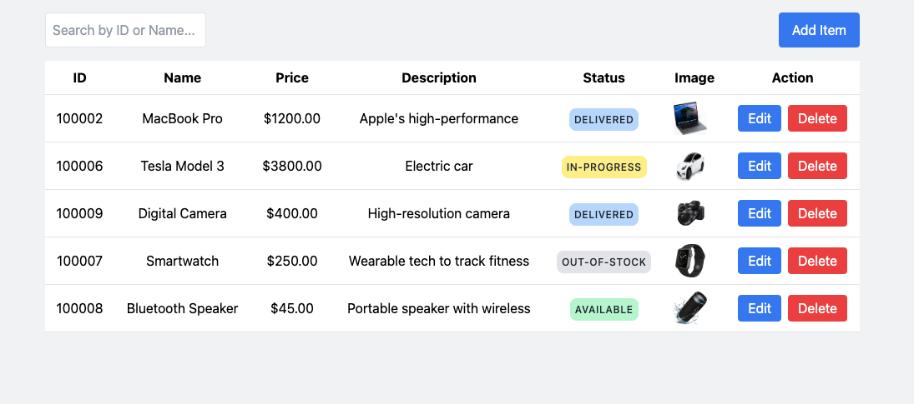
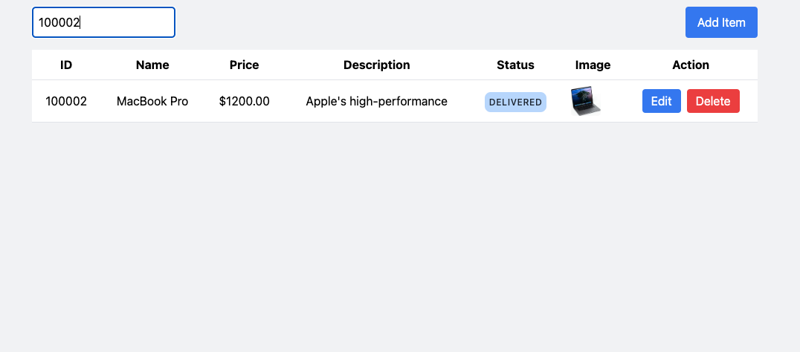
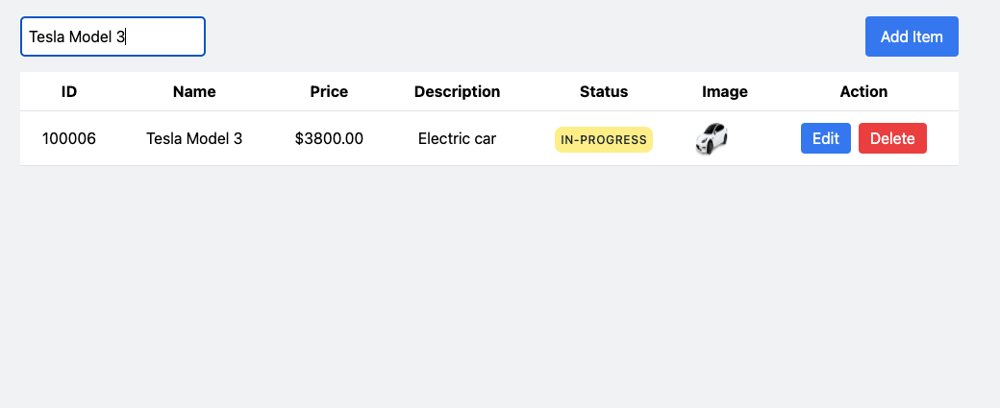
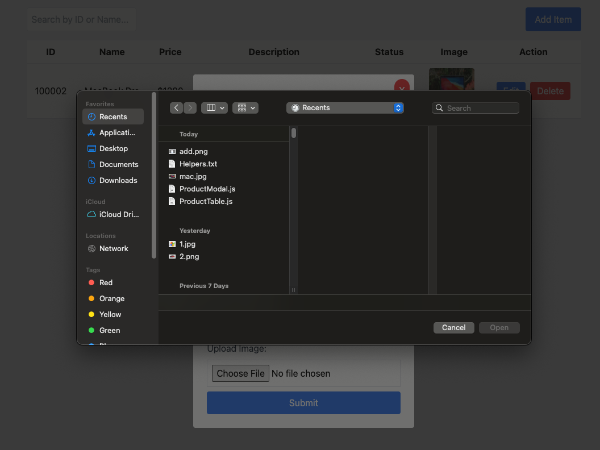
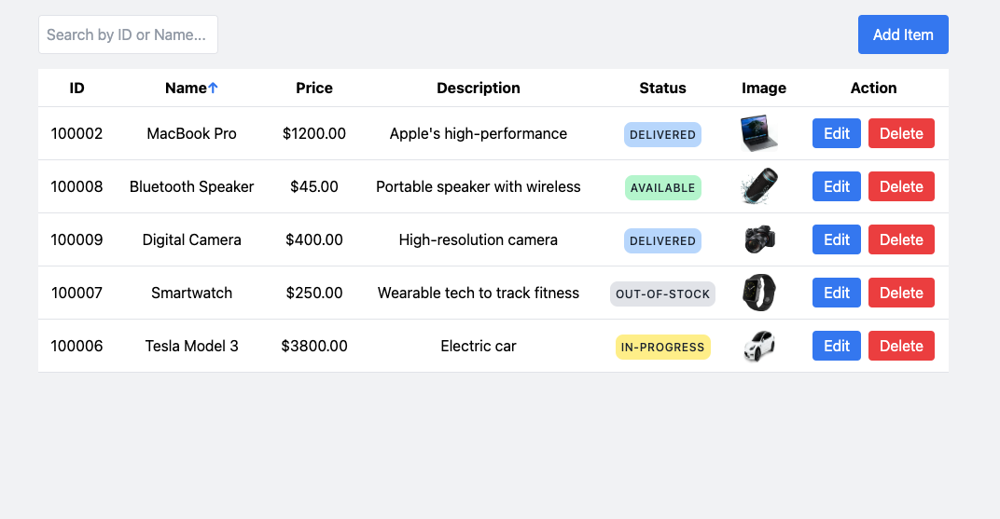
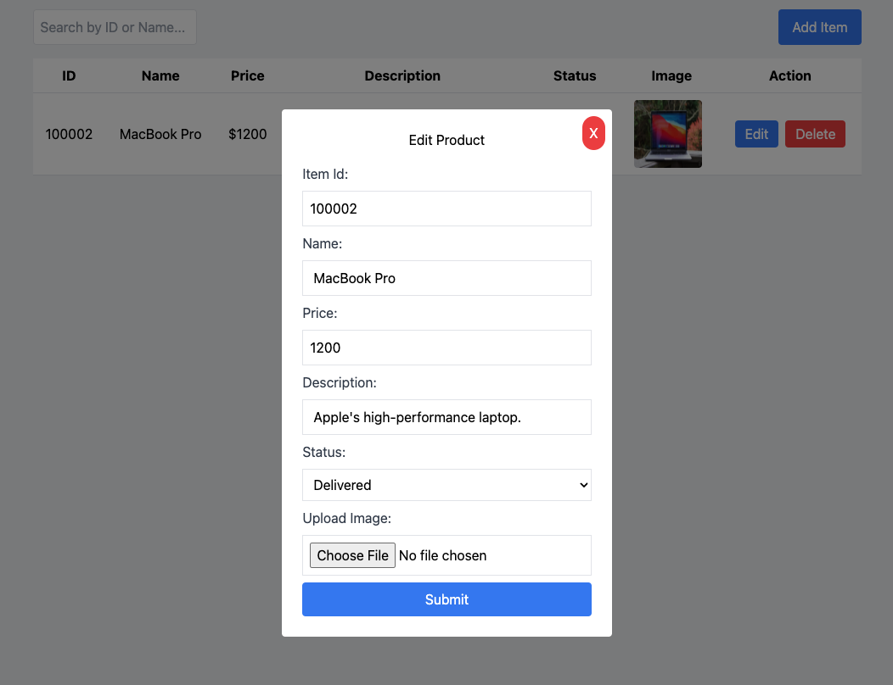
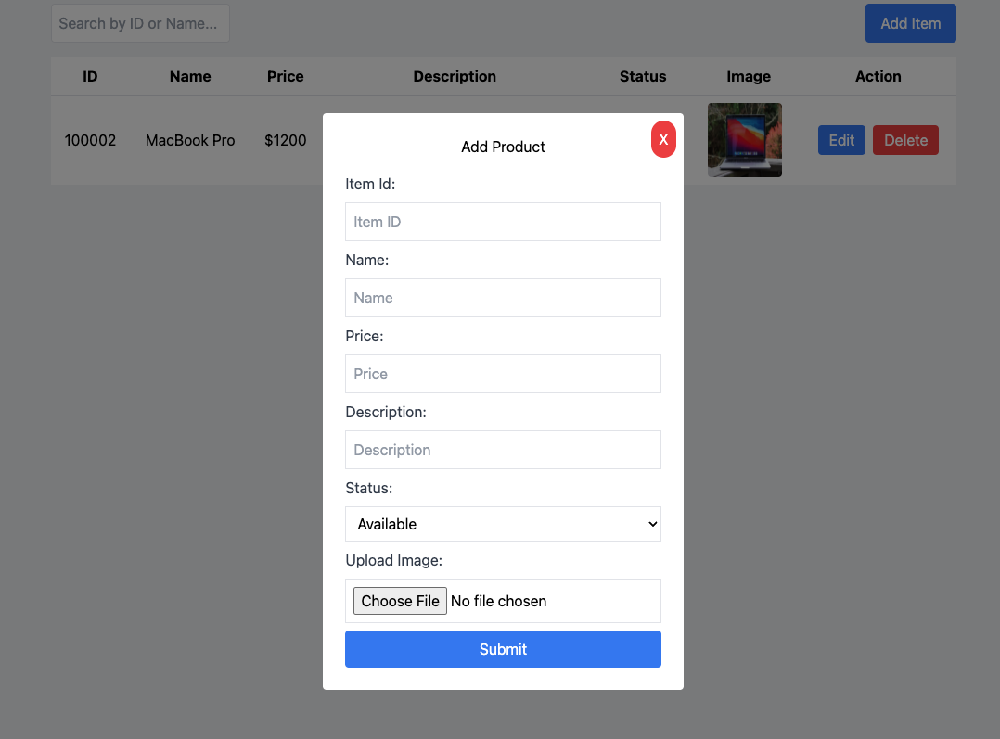
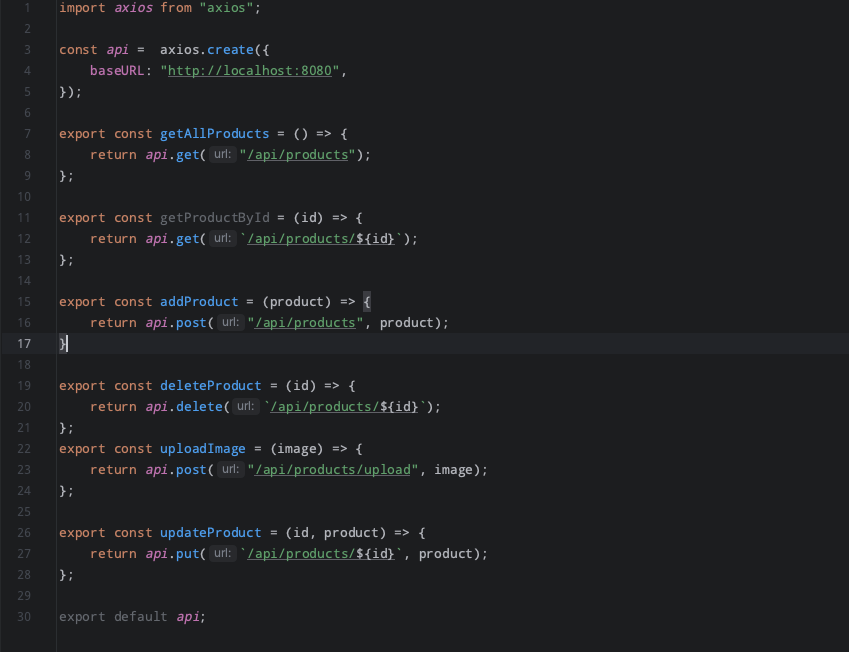

---------------------- Product ---------------------->

    - Project description:
      The project has been developed with React in the frontend and 
      Spring Boot in the backend. All data are persisted using the H2 database
      of springboot allowing us to share all the data via an API call handle by Axios 
      The user can do a simple CRUD of a product which content: id, name, description,
      price, status, image and an action where the user can edit or delete a product.

      The user can also add a new product by clicking on the button "Add item" which
      will open a modal where the user can add a new product description. The user can also 
      edit a product by clicking on the button "Edit" which will open a modal, load the selected
      product content where the user can edit. The user can also delete a product by cliking on the 
      delete button.

      The user can sort the table my clicking on the table header ID or name. 
      The user can also search a product by ID or name.

      Every action of the user is combined with a specific API call to the backend to handle
      the task the user want to perform
    
--------
    - Functionalities:
      The backend and the frontend are completely separated and communicate via an API call.
      The image upload by the user is first send to firebase storage and then the link
      is send back to be render in the frontend via api call.
    

--------
The dashboard of the application is the following:

Search a product by ID:

Search a product by name:

Upload an image from the computer:

Click on the id or name to sort the table:

Edit a product:

Add a product:

API call to the backend code:

